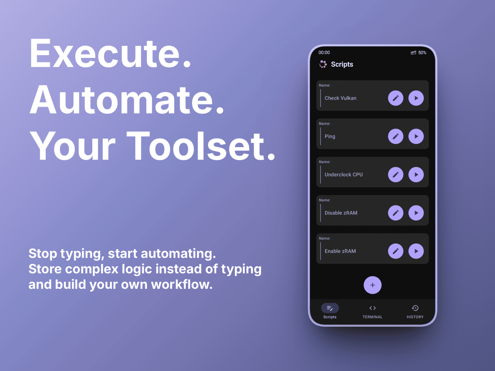

  

  
  
  <!--  -->
  
  

# 🍃 DTerminal

Forget clunky and dated terminals. DTerminal is a modern terminal emulator for Android, built with **Jetpack Compose**. It provides access to both standard and root shells through a reactive and asynchronous interface, designed for fluid performance and a clean, responsive user experience. All without the lag of traditional terminal apps.

## 🌟 Key Features

- 🔓 **Full Shell Authority**: High-speed execution for both standard (sh) and root (su) commands.
- 🎨 **Real-time Modern UI**: Instant reactive customization of fonts and colors.
- 🚀 **Ultra-Lightweight**: Optimized for speed and low battery consumption using the latest Material You standards.

| ⚡ Persistent Scripting | 📜 Smart Command History |
| :---: | :---: |
|  |  |
| A smart workspace to save and execute your custom scripts. eliminating repetitive mobile typing. | Persistent access to your command history in a clean and organized layout. |

## 📥 Getting Started

#### Prerequisites

- Android 8.0+ "Oreo"
- (Optional) Root access for su commands

#### Installation

1. Download the latest released APK from the [Releases Page](https://github.com/dedeadend/DTerminal/releases/latest).
2. Install downloaded APK file.
3. Enjoy 💚

## 📌 Note

Since DTerminal is a newly released, self-signed APK not yet distributed via the Play Store, Google Play Protect may flag it as "Unknown". As an open-source project, you can always audit the source code yourself or build the APK from source to ensure total transparency.

## ⌨️ Custom Commands

DTerminal extends standard shell functionality with integrated custom commands:

| Command | Usage | Description |
|---------|-------|-------------|
| `help` | `help` | Show list of custom commands |
| `about` | `about` | Information about DTerminal |
| `clear/cls` | `clear` | Clear all terminal logs |
| `sysinfo` | `sysinfo` | Display device and OS details |
| `random` | `random <a> <b>` | Generate a random number between a and b |
| `sudo` | `sudo <cmd>` | Run a specific command with root privileges |
| `font` | `font <size>` | Set terminal font size |
| `color` | `color <r> <g> <b>` | Set terminal text color |

## 🛠 Tech Stack

- **UI**: Jetpack Compose (Material 3)
- **Architecture**: MVVM + Clean Architecture
- **Dependency Injection**: Hilt
- **Database**: Room
- **Concurrency**: Kotlin Coroutines & Flow
- **Build System**: Gradle (Kotlin DSL)

## 🤝 Contributing

Contributions make the open-source community an amazing place to learn, inspire, and create. Any contributions you make are greatly appreciated.

1. **Fork** the Project
2. Create your Feature Branch  
   `git checkout -b feature/AmazingFeature`
3. **Commit** your Changes  
   `git commit -m 'Add some AmazingFeature'`
4. **Push** to the Branch  
   `git push origin feature/AmazingFeature`
5. Open a **Pull Request**

## ♠️ Support

Have questions or need help? Feel free to reach out:

  
  <!--  -->

## ❤️ Donation

If you find this project helpful, please give it a ⭐

You can also support the development by buying me a coffee:

  

## ⚖️ License

Distributed under the GPL-3.0 License. See [LICENSE](LICENSE) for more information.

---

  Developed with 💚 by <a href="https://github.com/dedeadend">DeDeadend</a>

