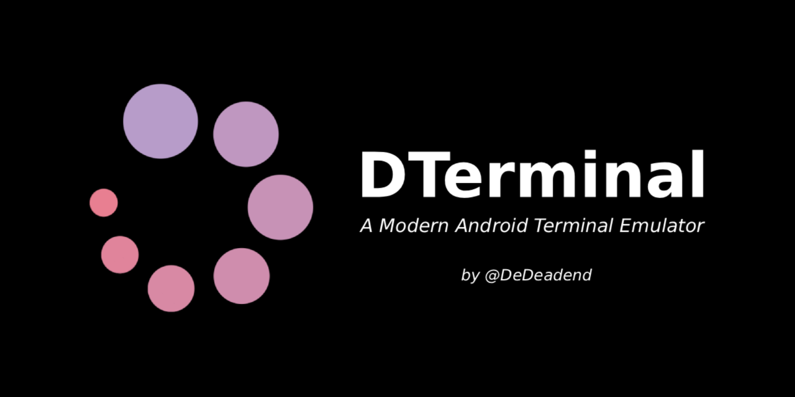

<p align="center">
  
</p>

<p align="center">
  
  
  
  
</p>


# 🍃 DTerminal

Forget outdated terminals! DTerminal is a modern, fast, lightweight **Android terminal** app with **built-in Python** support. No lag, no bloat. Just a clean, simple, and powerful environment for automation and scripting on a smooth interface built with **Jetpack Compose**.


## ✨ Features

- 💯 **Full Shell Authority**: High-speed, isolated execution for both standard (`sh`) and root (`su`) commands.
- 🐍 **Embedded Python 3.13 Engine**: An offline Python runtime powered by Chaquopy, featuring native `cryptography` C-extensions. Ready for advanced security tools, SSH automation, and cryptographic scripting.
- 🫧 **Multi-line Batch Execution**: Combine, edit, and execute multiple related shell or Python operations sequentially in a single process run.
- 📝 **Script Manager**: Save, organize, and quickly recall your frequently used custom automation scripts without repetitive typing.
- 📜 **Command History**: Instant access to your previously executed shell and Python commands in a clean, scrollable log layout.
- 🪄 **Magic 'py' Interpreter Mode**: Type `py` on the very first line of your input block to instantly switch the entire execution engine into a pure Python environment for all subsequent lines.
- 📦 **Runtime Pip Package Manager**: Download, extract, and update pure Python packages (`none-any.whl`) directly from PyPI on the fly.
- 🔗 **Advanced Argument Parsing**: Execute local scripts seamlessly with standard terminal syntax, including full support for custom inline CLI arguments and quote strings.
- 🎨 **Real-time Modern UI**: Instant dynamic customization of font size and multi-layered typography colors.


## ⚙️ How It Works

DTerminal provides a terminal environment for both Android shell commands and Python execution.

Shell commands are executed through the Android shell, while Python commands and scripts are handled by the embedded Python 3.13 runtime.

### Shell Execution

Standard shell commands can be entered directly into the terminal.

By default, commands run with the application's normal shell privileges. To execute commands with root privileges, open the three-dot menu and select **Switch to Root mode**. Once enabled, all subsequent commands are executed through `su` until the mode is switched back.

### Python Execution

DTerminal includes Python 3.13 through Chaquopy. Python can be used interactively inside the terminal or for scripts stored in the application workspace.

Starting a block with `py` switches that block to Python execution:

```text
py
print("Hello from Python")
```

Local Python scripts can also be executed with arguments:

```text
python script.py arg1 arg2
```

### Runtime Packages

DTerminal includes a pip-style package workflow for pure-Python packages available from PyPI.

```text
pip install package
pip list
pip uninstall package
```

Packages are installed into the application's Python runtime and remain available for later executions.


## 📸 Screenshots

| Scripts | History |
|:---:|:---:|
|  |  |


## 📥 Getting Started

### Requirements

- Android 11.0+ (API 30)
- **Root** is optional and only required for commands that need root privileges

### Installation

1. Download the latest APK from the [Releases Page](https://github.com/dedeadend/DTerminal/releases/latest).
2. Install the APK on your Android device.
3. Enjoy 💚

> [!NOTE]
> Since KillMyApps is a self-signed APK not distributed via the Google Play Store, Google Play Protect may flag it as "Unknown". As an open-source project, you can always audit the source code yourself or build the APK from source to ensure total transparency.


## 🧩 Custom Commands Reference

DTerminal extends standard shell capabilities with a built-in suite of specialized utility subsystems:

### System Commands
| Command | Usage | Description |
|:---|:---|:---|
| `help` | `help` | Show this command list documentation |
| `about` | `about` | Display app and developer info |
| `clear` / `cls` | `clear` / `cls` | Clear all terminal console logs |
| `sysinfo` | `sysinfo` | Advanced hardware & OS details |
| `uptime` | `uptime` | Show system boot duration |
| `datetime` | `datetime` | Display current date & time |
| `sudo` | `sudo [cmd]` | Simulate root privilege command execution |

### Customization Commands
| Command | Usage | Description |
|:---|:---|:---|
| `font` | `font [size]` | Set terminal font size (5-25) |
| `font def` | `font def` | Reset font size to default (11) |
| `color1` | `color1 [r g b]` | Set Normal text color using RGB values |
| `color1 def` | `color1 def` | Reset Normal text color to default |
| `color2` | `color2 [r g b]` | Set Error text color using RGB values |
| `color2 def` | `color2 def` | Reset Error text color to default |
| `color3` | `color3 [r g b]` | Set Info text color using RGB values |
| `color3 def` | `color3 def` | Reset Info text color to default |

### Text Processing Utilities
| Command | Usage | Description |
|:---|:---|:---|
| `random` | `random [a] [b]` | Generate number between a and b |
| `uuid` | `uuid` | Generate a random UUID v4 string |
| `length` | `length [text]` | Count characters in a string |
| `case` | `case [up/low] [text]` | Convert text to upper/lowercase |
| `wordcount` | `wordcount [text]` | Count words in the given text |
| `sort` | `sort [word1] [word2] ...` | Sort list of words alphabetically |
| `shuffle` | `shuffle [word1] [word2] ...` | Randomly shuffle list of words |
| `reverse` | `reverse [text]` | Reverse character order of text |
| `palindrome`| `palindrome [text]` | Check if text is a palindrome |
| `regex` | `regex [pattern] [text]` | Find regex matches within text |

### Crypto & Encoding Tools
| Command | Usage | Description |
|:---|:---|:---|
| `base64` | `base64 [enc/dec] [text]` | Encode or decode Base64 strings |
| `hash` | `hash [algo] [text]` | Generate md5, sha1, sha256 checksums |
| `url` | `url [enc/dec] [text]` | Encode or decode URL components |
| `rot13` | `rot13 [text]` | Apply ROT13 cipher to text |
| `morse` | `morse [enc/dec] [text]` | Encode or decode Morse code |
| `binary` | `binary [enc/dec] [text]` | Convert text to/from binary stream |
| `hex` | `hex [enc/dec] [text]` | Convert text to/from hex string |
| `ascii` | `ascii [single char]` | Get decimal ASCII code of a char |

### Developer Utilities
| Command | Usage | Description |
|:---|:---|:---|
| `pass` | `pass [length]` | Generate secure random password |
| `json` | `json [validate/format] [txt]` | Validate or pretty-print JSON strings |

### Python Engine Subsystem
| Command | Usage | Description |
|:---|:---|:---|
| `py` | Line-1 execution trigger | Switch execution engine block to interactive Python mode |
| `python` | `python [file_path] [args...]` | Execute a local script from storage with CLI args & quotes |
| `pip install`| `pip install [package]` | Download & install a Pure Python package from PyPI |
| `pip uninstall`| `pip uninstall [package]`| Completely remove an installed package from runtime environment |
| `pip list` | `pip list` | List all user-installed Python packages |


## 🛠 Tech Stack

- **UI**: Jetpack Compose (Material 3 Adaptive Design)
- **Architecture**: MVI (Model-View-Intent) + Clean Architecture + Unidirectional Data Flow (UDF)
- **Concurrency**: Kotlin Coroutines & Flow
- **Python Subsystem**: Chaquopy (Python 3.13 Runtime)
- **Dependency Injection**: Hilt
- **Database**: Room
- **Build System**: Gradle (Kotlin DSL)


## 🤝 Contributing

Contributions are welcome.

1. Fork the repository.
2. Create a feature branch:

   ```bash
   git checkout -b feature/AmazingFeature
   ```

3. Commit your changes:

   ```bash
   git commit -m "Add some AmazingFeature"
   ```

4. Push the branch:

   ```bash
   git push origin feature/AmazingFeature
   ```

5. Open a Pull Request.


## 🌐 Official DeDeadend Links

DTerminal is one of the **DeDeadend** projects:

<div align="left">
  <a href="https://dedeadend.github.io/projects/dterminal/" target="_blank" rel="noreferrer noopener">
    
  </a>
  <a href="https://t.me/dedeadend_projects" target="_blank" rel="noreferrer noopener">
    
  </a>
  <a href="https://t.me/dedeadend_community" target="_blank" rel="noreferrer noopener">
    
  </a>
  <a href="https://t.me/dedeadend" target="_blank" rel="noreferrer noopener">
    
  </a>
</div>


## ❤️ Donation

If you find this project helpful, please give it a ⭐

You can also support the development through a donation:

<div align="left">
  <a href="https://nowpayments.io/donation/dedeadend" target="_blank" rel="noreferrer noopener">
    
  </a>
</div>


## ⚖️ License

Distributed under the GPL-3.0 License. See [LICENSE](LICENSE) for more information.


---


<div align="center">
  Developed with 💚 by <a href="https://github.com/dedeadend">DeDeadend</a>
</div>
